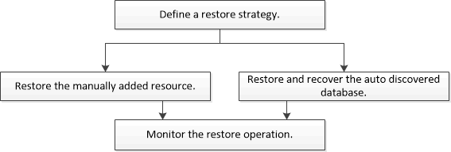

= カスタムプラグインリソースのリストア
:allow-uri-read: 
:icons: font
:imagesdir: ../media/

[role="lead"]
リストアとリカバリのワークフローには、計画、リストア処理の実行、および処理の監視が含まれます。

.タスクの内容
次のワークフローは、リストア処理の実行順序を示しています。

PowerShellコマンドレットを手動またはスクリプトで使用して、バックアップ、リストア、クローニングの処理を実行することもできます。PowerShellコマンドレットの詳細については、SnapCenterコマンドレットのヘルプを使用するか、を参照してください https://library.netapp.com/ecm/ecm_download_file/ECMLP2886895["SnapCenter ソフトウェアコマンドレットリファレンスガイド"]。
